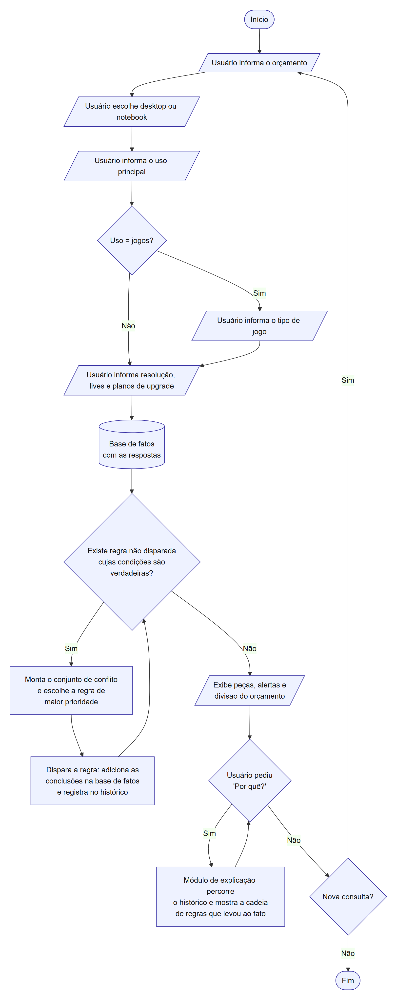
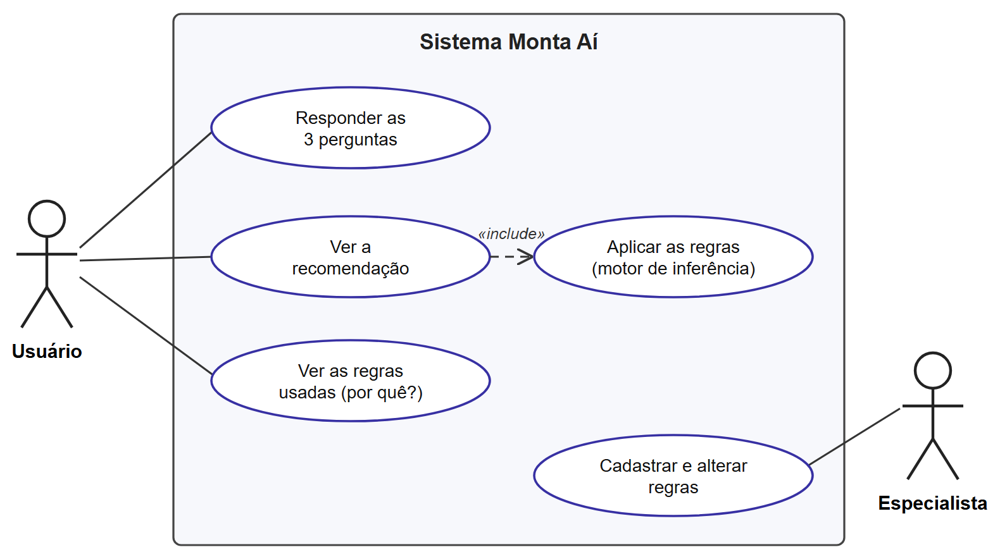
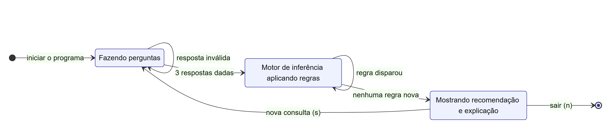

# Monta Aí: sistema especialista em recomendação de computadores

Trabalho da **Atividade Avaliativa A1** da disciplina **Programação de Sistemas Especialistas**,
do curso de Ciência da Computação da
Universidade Veiga de Almeida (Campus Tijuca), sob orientação do
Prof. Vinicius Marques da Silva Ferreira.

**Integrantes:** Lucas Pires da Costa (1250122691), Ruan da Silva Marques (1250124415) e
Lucas Santos Garcia (1250117441).

**Protótipo de telas:** https://brasdp.github.io/monta-ai/prototipo/

O Monta Aí ajuda quem vai comprar ou montar um computador sem entender de hardware.
O usuário informa o orçamento, o formato (desktop ou notebook), para que vai usar,
a resolução do monitor, se faz lives e se pretende fazer upgrade. O sistema então:

- deduz o **perfil** do usuário e os **requisitos** desse perfil;
- limita cada peça ao que o **orçamento** permite;
- recomenda processador, placa de vídeo, memória, armazenamento, placa-mãe e fonte **por nível**
  (e não por modelo, porque modelos e preços mudam toda semana);
- emite **alertas** de orçamento curto, gargalo e incompatibilidade;
- sugere **como dividir o dinheiro** entre as peças;
- **explica** cada conclusão, mostrando a cadeia de regras que levou até ela.

## Como executar

Precisa apenas do Python 3.10 ou mais novo, sem nenhuma biblioteca extra.

```bash
python app.py        # versão com janelas (Tkinter)
python terminal.py   # versão de terminal
python -m unittest   # testes automatizados
```

## Arquitetura do sistema especialista

```
monta_ai/
├── motor.py              Motor de inferência (encadeamento para frente) e módulo de explicação
├── base_conhecimento.py  Base de conhecimento: 54 regras SE ... ENTÃO ...
├── catalogo.py           Perguntas ao usuário e descrição dos níveis de cada peça
└── sistema.py            Liga tudo e formata os resultados e as explicações
app.py                    Interface gráfica
terminal.py               Interface de terminal
tests/                    Testes (inclusive todas as combinações possíveis de respostas)
prototipo/index.html      Protótipo navegável das telas
docs/                     Diagramas, imagens e relatório em PDF
```

| Componente | Onde está | O que faz |
|---|---|---|
| Base de fatos | `MotorInferencia.fatos` | Respostas do usuário + tudo o que o motor deduz |
| Base de conhecimento | `base_conhecimento.py` | Regras de produção escritas a partir do conhecimento do especialista |
| Motor de inferência | `motor.py` | Encadeamento para frente com resolução de conflito por prioridade |
| Módulo de explicação | `motor.py` / `sistema.py` | Refaz o caminho de regras que gerou cada fato ("Por quê?") |
| Interface | `app.py`, `terminal.py` | Faz as perguntas e mostra o resultado |

### Ciclo do motor de inferência

1. Monta o **conjunto de conflito**: as regras ainda não disparadas cujas condições são verdadeiras
   e que acrescentam algum fato novo.
2. Escolhe a regra de **maior prioridade** (empate: a que vem primeiro na base).
3. **Dispara** a regra: acrescenta as conclusões na base de fatos e registra no histórico.
4. Repete até não haver regra aplicável.

### Grupos de regras

| Regras | Grupo | Exemplo |
|---|---|---|
| R01–R04 | Classificação do orçamento | orçamento de R$ 6.000 → faixa 3 |
| R05–R10 | Perfil de uso | uso = jogos e jogos pesados → gamer entusiasta |
| R11–R16 | Requisitos do perfil | gamer entusiasta → placa de vídeo nível 3, 16 GB... |
| R17–R24 | Ajustes (resolução e lives) | monitor 1440p → placa de vídeo +1 nível |
| R25–R27 | Limite do orçamento | desktop na faixa 3 → teto de placa de vídeo nível 3 |
| R28–R33 | Recomendação | recomendada = menor entre a necessária e o teto |
| R34–R40 | Fonte e placa-mãe | upgrade + placa dedicada → fonte 750 W (prioridade maior) |
| R41–R43 | Distribuição do orçamento | jogos → 40% do dinheiro na placa de vídeo |
| R44–R53 | Alertas | placa de vídeo necessária acima do teto → alerta de orçamento |
| R54 | Objetivo | todas as peças definidas → recomendação completa |

### Exemplo de encadeamento

Gamer que joga jogos pesados num monitor 1440p, com R$ 6.000:

```
R08  uso = jogos, tipo = pesados          → perfil = gamer entusiasta
R14  perfil = gamer entusiasta            → placa de vídeo do perfil = 3
R18  gamer + monitor 1440p                → ajuste pela resolução = 1
R23  3 + 1                                → placa de vídeo necessária = 4
R03  orçamento = R$ 6.000                 → faixa 3
R25  desktop + faixa 3                    → teto de placa de vídeo = 3
R28  menor entre 4 e 3                    → placa de vídeo recomendada = 3 (intermediária-alta)
R44  necessária (4) > teto (3)            → alerta: orçamento abaixo do ideal
```

## Diagramas

| Fluxograma | Casos de uso | Estados |
|---|---|---|
|  |  |  |

Os fontes estão em `docs/diagramas/` (Mermaid e SVG).

## Protótipo de telas

**Abrir o protótipo:** https://brasdp.github.io/monta-ai/prototipo/

Clique nos botões para navegar entre as telas. O código do protótipo está em
[`prototipo/index.html`](prototipo/index.html).


## Relatório

O relatório completo, nas normas da ABNT, está em [`docs/Relatorio_MontaAi.pdf`](docs/Relatorio_MontaAi.pdf).
